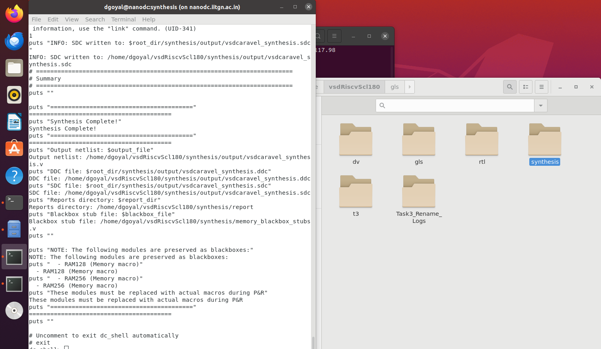
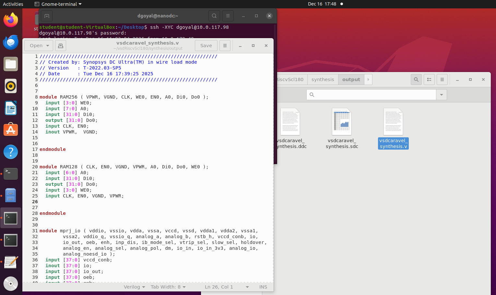
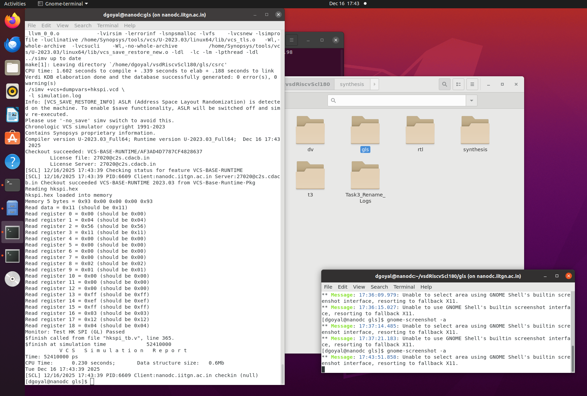
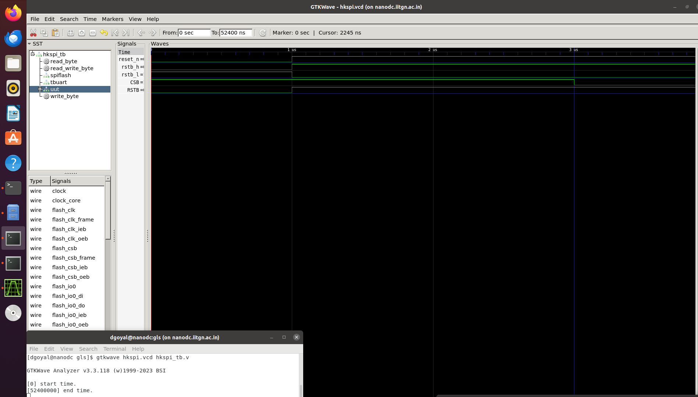
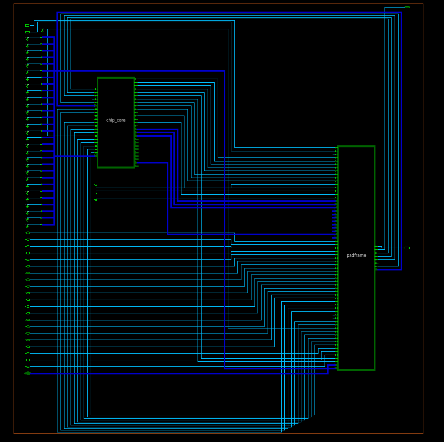

# Task-4: Complete Removal of On-Chip POR and Final GLS Validation  
### VSD Caravel-Based RISC-V SoC | SCL-180 Technology

---

## 1. Introduction

This repository documents the **complete execution and validation of Task-3**, whose goal is to **remove the on-chip Power-On Reset (POR)** from a **VSD Caravel-based RISC-V SoC** and prove—through **engineering reasoning, RTL refactoring, synthesis, and gate-level simulation**—that a **pure external reset architecture is safe, correct, and industry-compliant for the SCL-180 PDK**.

Unlike earlier stages where a **behavioral `dummy_por`** was used for convenience, this task enforces **realistic silicon design principles**, where:

- POR is an **analog function**
- Reset must be **explicit, verifiable, and externally controllable**
- No non-synthesizable abstractions are allowed

The outcome is a **POR-free SoC** that relies **only on a single external active-low reset pin (`reset_n`)**, validated end-to-end up to **final Gate-Level Simulation (GLS)**.

---

## 2. Why This Task Exists (Design Context)

In many academic and early RTL flows, designers rely on:
- Behavioral POR logic
- Counters
- Reset sequencing FSMs
- Power-edge detection in RTL

These approaches are **fundamentally incorrect for real silicon**.

### Key Reasons

1. **POR is not digital**
   - True POR circuits are **analog macros**
   - They detect supply ramps, brown-outs, and thresholds

2. **Behavioral PORs are non-synthesizable**
   - They cannot map to standard cells
   - They introduce false confidence in simulations

3. **Modern pad libraries already solve reset availability**
   - In SCL-180, reset pads are usable immediately after VDD
   - No internal POR gating is required

This task exists to **force architectural correctness**, not just functional success.

---

## 3. Objective of This Repository

By the end of this task, the design must demonstrate:

- ❌ No `dummy_por`
- ❌ No POR-derived signals
- ❌ No internal reset generation logic
- ✅ One explicit external reset pin
- ✅ Clean DC_TOPO synthesis
- ✅ Clean VCS-based GLS
- ✅ Full technical justification

---

## 4. Reset Architecture – Final Design

### 4.1 Reset Strategy

| Property | Implementation |
|--------|----------------|
Reset Source | External |
Reset Pin | `reset_n` |
Polarity | Active-Low |
POR Logic | Completely removed |
Reset Generation | Testbench-driven |
Reset Distribution | Explicit in RTL |

There is **no implicit power-up behavior** assumed anywhere in the design.

---

### 4.2 What Changed Architecturally

#### Removed

- `dummy_por`
- POR-dependent signals:
  - `porb_h`
  - `porb_l`
  - `por_l`
- Any logic assuming:
  - Power-up sequencing
  - Internal reset generation
  - Power pin transitions

#### Added

- A **single top-level reset pin**:
  ```verilog
  input reset_n;
  ```

* Explicit reset usage in **all sequential logic**


## 5. RTL Refactoring Details

### 5.1 Scope of RTL Changes

The following **categories of modules** were modified:

* Top-level SoC integration
* Core reset distribution
* Housekeeping logic
* Clocking and peripheral logic
* Wrapper modules

> No functional logic was altered beyond reset handling.

---

### 5.2 Files Modified for Reset Migration


```text
./caravel_openframe.v
./clock_div.v
./__openframe_project_wrapper.v
./caravel_core.v
./caravel_clocking.v
./caravel.v
./chip_io.v
./digital_pll.v
./vsdcaravel.v

```

All replacements were verified through:

* Manual audit
* Grep-based POR checks
* Synthesis validation
* GLS behavior

<div align="center" >
  
</div>

<div align="center" >
  
</div>
---

## 6. Synthesis Flow (DC_TOPO – SCL-180)

### 6.1 Toolchain

* **Synthesis Tool**: Synopsys DC_TOPO
* **Technology**: SCL-180
* **Cell Libraries**: Standard cell + IO libraries
* **Constraints**: External reset (`reset_n`)
* **POR Blackboxes**: None

---

### 6.2 Synthesis Goals

The synthesis flow was validated against the following criteria:

✔ No unresolved reset nets
✔ No floating enables
✔ No latch inference
✔ No POR blackboxes
✔ Clean timing closure
✔ Clean area and power reports

---

### 6.3 Key Outputs

Relevant synthesis artifacts:

```text
synthesis/
├── output/
│   ├── vsdcaravel_synthesis.v
│   ├── vsdcaravel_synthesis.sdc
│   └── vsdcaravel_synthesis.ddc
│
├── report/
│   ├── timing_post_synth.rpt
│   ├── area_post_synth.rpt
│   ├── power_post_synth.rpt
│   └── blackbox_modules.rpt
│
├── synthesis_after_rst_fix.log
└── synthesis_complete_errors_warnings.md

```

The synthesized netlist contains **no POR logic** and uses **only `reset_n`**.


<div align="center" >
  
</div>

<div align="center" >
  
</div>

---

## 7. Gate-Level Simulation (Final Proof)

### 7.1 GLS Configuration

* **Simulator**: Synopsys VCS
* **Netlist**: DC_TOPO synthesized netlist
* **Cell Models**: SCL-180 functional models
* **Reset Source**: Testbench-driven `reset_n`

---

### 7.2 GLS Expectations

During GLS, the following behavior was required:

* Reset asserted externally
* Reset cleanly released
* No X-propagation
* Functional equivalence with RTL

---

### 7.3 GLS Evidence

Relevant GLS artifacts:

```text
gls/
├── gls_log.log
├── simulation.log
├── hkspi_tb_gl.v
└── hkspi.vcd
```

<div align="center" >
  
</div>


<div align="center" >
  
</div>


Waveforms confirm:

* Deterministic reset behavior
* Stable operation post reset
* No POR dependency

---

## 8. Logs and Audit Trail

To ensure traceability, the following logs were preserved:

```text
Logs_during_renaming/
├── baseline_count.txt
├── files_to_modify.txt
└── complete.log
```

These logs capture:

* Initial POR usage count
* Files requiring modification
* Completion of POR removal

---

## 9. Visual Evidence

Screenshots and waveforms are provided under:

```text
assets/
├── rtl_passed_wo_dummy_por.png
├── gls_passed_wo_dummy_por.png
├── synthesis_complete.png
├── reset_n_padframe.png
└── synthesis_file_wo_dummy_por.png
```

<div align="center" >
  
</div>

<div align="center" >
  
</div>

Only reset_n pin is their in the vsdcaravel.

<div align="center" >
  
</div>

---

## 10. Final Engineering Conclusion

This work conclusively proves that:

* **POR is an analog problem**
* **RTL-based PORs are unsafe abstractions**
* **SCL-180 pads allow immediate reset usability**
* **A single external reset pin is sufficient**
* The SoC is:

  * Synthesizable
  * Reset-deterministic
  * GLS-clean
  * Industry-correct

This implementation reflects **real tapeout-grade SoC design methodology**.

---

## 11. Status

✅ POR fully removed
✅ RTL refactored
✅ DC_TOPO synthesis clean
✅ GLS passed
✅ Documentation complete

**Task-3 successfully completed.**
