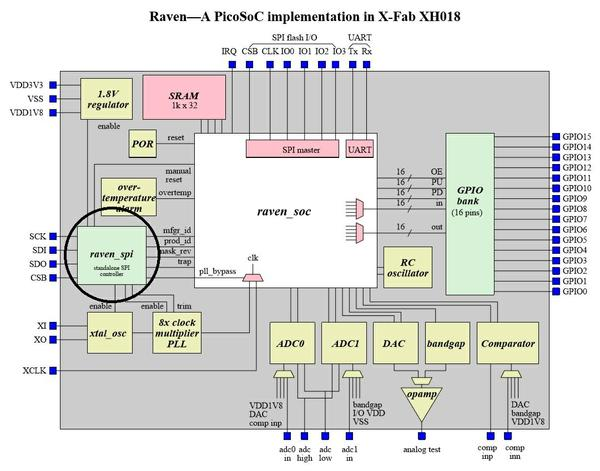
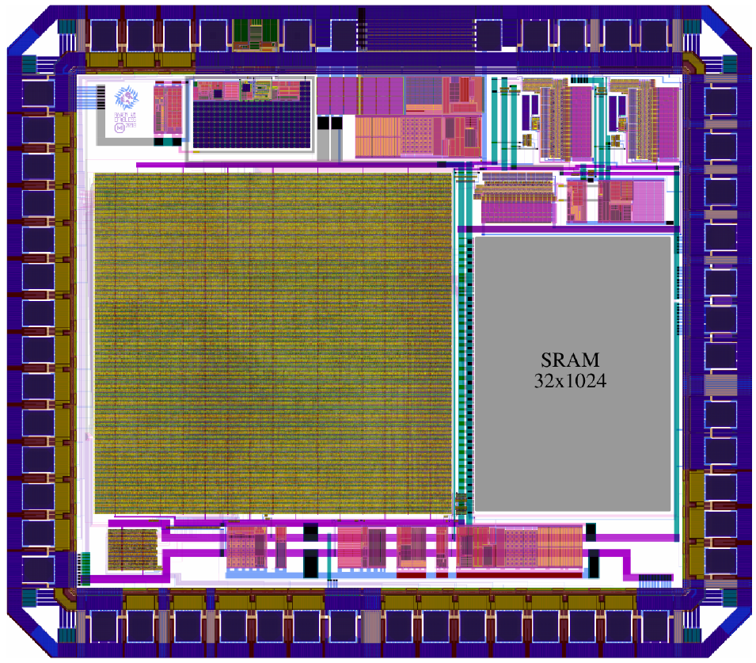
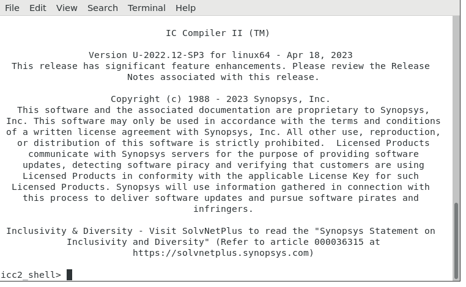
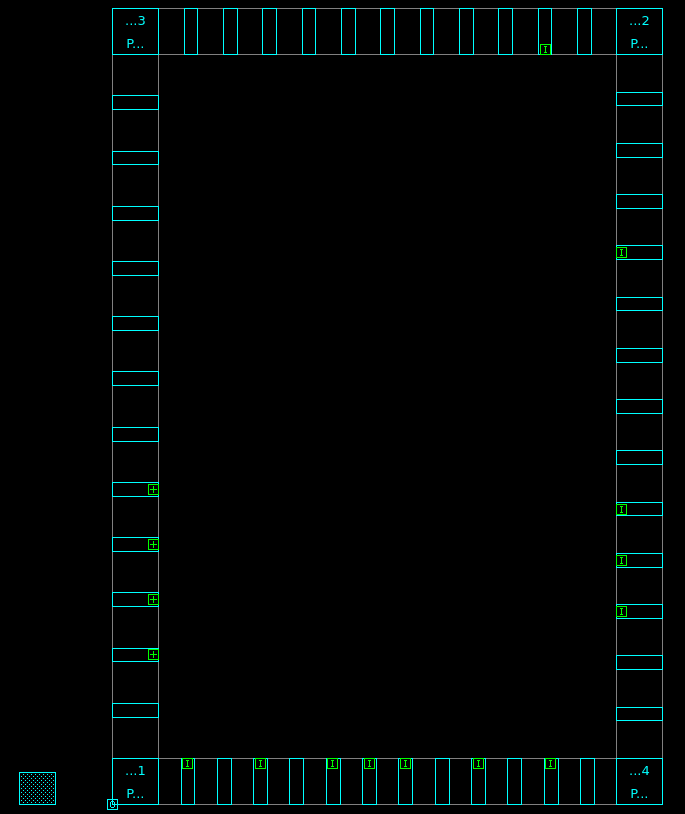

# 🧩 Task 5 — SoC Floorplanning Using Synopsys ICC2

### *(Floorplan-Only Physical Design Stage)*

---

## 📘 Overview

This repository documents **Task 5** of the backend physical design flow, focusing **exclusively on SoC floorplanning** using **Synopsys IC Compiler II (ICC2)**.

The intent of this task is **not** to perform placement, CTS, routing, or optimization, but to **establish a physically correct and deterministic floorplan** that can safely act as the foundation for all subsequent backend stages.

> 🔒 **Scope Enforcement**
>
> * ✅ Die and core definition
> * ✅ IO pad placement
> * ✅ Power/ground connectivity
> * ❌ Standard-cell placement
> * ❌ CTS
> * ❌ Routing
> * ❌ Power grid design

<div align="center" >
  
</div>

<div align="center" >
  
</div>


---

## 📜 Table of Contents

1. [Objective](#-objective)
2. [Introduction to Floorplanning and ICC2](#-introduction-to-floorplanning-and-icc2)
3. [Floorplanning Target Specifications](#-floorplanning-target-specifications)
4. [ICC2 Workshop Collaterals — Directory Structure](#-icc2-workshop-collaterals--directory-structure)
5. [Prerequisites](#-prerequisites)
6. [ICC2 Execution and GUI Usage](#-icc2-execution-and-gui-usage)
7. [Floorplanning Tcl Script](#-floorplanning-tcl-script)
8. [Detailed Section-wise Tcl Explanation](#-detailed-section-wise-tcl-explanation)
9. [Floorplan Iterations and Debugging](#-floorplan-iterations-and-debugging)
10. [Final Floorplan Analysis](#-final-floorplan-analysis)
11. [Execution Summary](#-execution-summary)
12. [Learning Outcomes](#-learning-outcomes)

---

## 🎯 Objective

The objective of Task 5 is to create a **correct and reproducible SoC floorplan using Synopsys ICC2**, strictly limited to the **floorplanning stage only**.

This includes:

* Defining an **exact die size of 3.588 mm × 5.188 mm**
* Defining a **core region with uniform margins**
* Ensuring **correct IO pad placement on all four die edges**
* Maintaining a **fully scripted and deterministic ICC2 flow**

No placement, CTS, routing, timing closure, or PDN activities are performed.

---

## 🧱 Introduction to Floorplanning and ICC2

### What is Floorplanning?

Floorplanning is the **first physical design step** where the *physical canvas* of the chip is defined. At this stage, ICC2 is instructed about:

* **Where the die boundary exists**
* **Where the core region begins**
* **Where IO pads are allowed to sit**
* **How much margin is reserved for routing**

Once floorplanning is complete, all later steps must operate **within these physical constraints**.

### Why Floorplanning Is Critical

A poor floorplan leads to:

| Issue                   | Impact                  |
| ----------------------- | ----------------------- |
| Incorrect die size      | Tapeout failure         |
| Small core margins      | Routing congestion      |
| Bad IO placement        | Signal integrity issues |
| Non-deterministic setup | Unreproducible runs     |

Hence, this task emphasizes **accuracy and discipline**, not optimization.

### Why ICC2?

**Synopsys IC Compiler II (ICC2)** is an industry-grade physical design tool that supports:

* NDM-based databases
* Script-driven backend flows
* High-capacity SoC designs

In this task, ICC2 is used **only for floorplanning**, keeping complexity under control.

---

## 📐 Floorplanning Target Specifications

All specifications listed below are treated as **fixed design constraints**.

---

### 1️⃣ Die Dimensions (Mandatory)

| Parameter      | Value              |
| -------------- | ------------------ |
| Die Width      | 3.588 mm (3588 µm) |
| Die Height     | 5.188 mm (5188 µm) |
| Total Die Area | 18.61 mm²          |
| Aspect Ratio   | 1.45 : 1           |

These values are **explicitly enforced** using ICC2 commands and verified in the GUI.

---

### 2️⃣ Core Area Definition

The core is placed **inside the die boundary** with uniform spacing.

| Parameter     | Value              |
| ------------- | ------------------ |
| Core Offset   | 300 µm (all sides) |
| Core Width    | 2.988 mm           |
| Core Height   | 4.588 mm           |
| Core Area     | 13.71 mm²          |
| Core Coverage | ~76%               |

**Why 300 µm margin?**

* Leaves space for IO routing
* Avoids congestion near pad-ring
* Aligns with standard SoC practices

---

### 3️⃣ IO Pad Placement Strategy

IO pads provide the interface between silicon and the external world.

#### Placement Rules

* Pads must lie **exactly on the die boundary**
* Pads must be distributed on **all four sides**
* Orientation must match the edge
* No floating or interior pads allowed

#### IO Composition

| Category            | Count        |
| ------------------- | ------------ |
| GPIO (gpio0–gpio37) | 38           |
| Flash Interface     | 5            |
| Control / Clock     | 11+          |
| Power / Ground      | Multiple     |
| **Total**           | **54+ pads** |

---

## 📁 ICC2 Workshop Collaterals — Directory Structure

Understanding the directory structure is essential for **debugging and reproducibility**.

```text
icc2_workshop_collaterals/
├── .git/                               → Git version control metadata
│
├── standaloneFlow/                     → Standalone ICC2 physical design flow
│   │
│   ├── scripts/                        → Primary ICC2 Tcl scripts
│   │   ├── top.tcl                     → Main ICC2 entry script (drives floorplanning)
│   │   ├── icc2_common_setup.tcl       → Common environment, library, and tool setup
│   │   ├── icc2_dp_setup.tcl           → Design planning and floorplan-specific setup
│   │   └── pad_placement_constraints.tcl
│   │                                   → IO pad placement rules and constraints
│   │
│   ├── outputs/                        → Key floorplanning outputs
│   │   ├── floorplan.def               → Final DEF containing die, core, and pad layout
│   │   ├── floorplan.log               → Log generated during floorplan creation
│   │   ├── floorplan_report.txt        → Summary report validating floorplan parameters
│   │   └── icc2_output.txt             → Consolidated ICC2 run output
│   │
│   ├── reports/                        → Essential verification and run logs
│   │   ├── check_design.log            → ICC2 design sanity check report
│   │   └── icc2_command.log            → Record of ICC2 commands executed
│   │
│   ├── CLIBs/                          → Compiled technology/reference libraries
│   │
│   ├── work/                           → ICC2 working database (design state storage)
│   │
│   └── other/                          → Autogenerated and non-essential artifacts
│       ├── outputs_icc2/               → Intermediate ICC2 outputs
│       ├── PreFrameCheck/              → Pre-run tool checks
│       ├── rpts_icc2/                  → Detailed ICC2 reports (unused in this task)
│       ├── tmp/                        → Temporary runtime files
│       ├── *.svf                       → Session and verification files
│       ├── flex*.log                   → Internal FlexNet/license logs
│       ├── *.example.tcl               → Example scripts not used directly
│       ├── *.ems                       → Workspace/environment metadata
│       └── Synopsys_stack_trace_*.txt  → Tool crash/debug stack traces
│
├── rtl_and_design_files/               → RTL sources defining the SoC
│   ├── raven_wrapper.v                 → Top-level SoC wrapper RTL
│   ├── raven_soc.v                     → Core SoC integration module
│   ├── raven_spi.v                     → SPI controller RTL
│   ├── picorv32.v                     → RISC-V CPU core RTL
│   ├── simpleuart.v                   → UART peripheral RTL
│   ├── spimemio.v                     → SPI memory interface RTL
│   └── spi_slave.v                    → SPI slave module RTL
│
├── constraints/                        → Design constraint files
│   └── raven_wrapper.sdc               → Timing constraints (not used in floorplan-only task)
│
├── synthesis/                          → Synthesis-related files
│   ├── raven_wrapper.synth.v           → Synthesized gate-level netlist
│   └── raven_wrapper.ys                → Yosys synthesis script
│
├── libraries/                          → Technology and standard-cell libraries
│   ├── nangate45nm.lib                 → Standard-cell timing library
│   ├── nangate_typical.lib             → Typical PVT timing library
│   ├── nangate_typical.db              → Synopsys DB format timing library
│   ├── nangate_stdcell.lef             → Standard-cell physical LEF
│   ├── nangate_tech.lef                → Technology LEF (routing layers, rules)
│   ├── pad.lef                         → IO pad physical definitions
│   ├── pad.lib                         → IO pad timing library
│   └── sram_32_1024_freepdk45*          → SRAM macro timing and physical views
│
├── documentation/                      → Project documentation
│   ├── README.md                       → High-level project description
│   └── ProjectDesignDocument.docx      → Detailed design documentation
│
└── other/                              → Supporting and reference-only files
    ├── sram.tar.gz                     → Archived SRAM files
    ├── sample_45nm.itf                 → Example interconnect tech file
    ├── sample_45nm.tluplus             → Example parasitic lookup tables
    └── cells_latch.v                   → Reference latch cell RTL
```

📌 **Important rule:**
All design intent lives in **scripts**, not in the GUI.

---

## 🔧 Prerequisites

### Software

* Synopsys IC Compiler II (U-2022.12 or newer)
* Valid ICC2 license
* Linux (RHEL / CentOS 7+)

### Hardware

| Resource | Recommended |
| -------- | ----------- |
| RAM      | 64 GB       |
| CPU      | 8+ cores    |
| Disk     | 100+ GB     |

### Design Inputs

* Synthesized netlist: `raven_wrapper.synth.v` using `yosys`
* Standard-cell LEF/LIB
* IO pad LEF/LIB
* SRAM macro views
* Technology files (FreePDK45)

---

## 🖥️ ICC2 Execution and GUI Usage

### ICC2 Invocation

```bash
icc2_shell
icc2_shell -f floorplan.tcl
icc2_shell -gui -f floorplan.tcl
```

<div align="center" >
  
</div>

### GUI Usage Guidelines

GUI is used only for:

* Verifying die boundary
* Inspecting core margins
* Confirming IO pad placement

❌ No manual edits are performed in GUI.

---

## 📝 Floorplanning Tcl Script

Below is the **exact Tcl flow** used for this task, followed by **line-by-line explanation**.
```bash
###############################################################################
# ICC2 Design Planning + Early Placement Flow
# Design  : vsdcaravel
# Stage   : DP + Floorplan + IO + Macro + Pin Placement
# Tool    : Synopsys ICC2
###############################################################################

# ============================================================================
# 0. Environment & Flow Setup
# ============================================================================
source -echo ./icc2_common_setup.tcl
source -echo ./icc2_dp_setup.tcl


# ============================================================================
# 1. Clean Workspace & Create NDM Library
# ============================================================================
if {[file exists ${WORK_DIR}/$DESIGN_LIBRARY]} {
   file delete -force ${WORK_DIR}/${DESIGN_LIBRARY}
}

set create_lib_cmd "create_lib ${WORK_DIR}/$DESIGN_LIBRARY"

if {[file exists [which $TECH_FILE]]} {
   lappend create_lib_cmd -tech $TECH_FILE
} elseif {$TECH_LIB != ""} {
   lappend create_lib_cmd -use_technology_lib $TECH_LIB
}

lappend create_lib_cmd -ref_libs $REFERENCE_LIBRARY
puts "RM-info : $create_lib_cmd"
eval ${create_lib_cmd}


# ============================================================================
# 2. Read Synthesized Netlist
# ============================================================================
if {$DP_FLOW == "hier" && $BOTTOM_BLOCK_VIEW == "abstract"} {
   puts "RM-info : Reading verilog outline (${VERILOG_NETLIST_FILES})"
   read_verilog_outline \
      -design ${DESIGN_NAME}/${INIT_DP_LABEL_NAME} \
      -top ${DESIGN_NAME} \
      ${VERILOG_NETLIST_FILES}
} else {
   puts "RM-info : Reading full chip verilog (${VERILOG_NETLIST_FILES})"
   read_verilog \
      -design ${DESIGN_NAME}/${INIT_DP_LABEL_NAME} \
      -top ${DESIGN_NAME} \
      ${VERILOG_NETLIST_FILES}
}


# ============================================================================
# 3. Technology & Parasitic Setup
# ============================================================================
if {$TECH_FILE != "" || ($TECH_LIB != "" && !$TECH_LIB_INCLUDES_TECH_SETUP_INFO)} {
   if {[file exists [which $TCL_TECH_SETUP_FILE]]} {
      puts "RM-info : Sourcing [which $TCL_TECH_SETUP_FILE]"
      source -echo $TCL_TECH_SETUP_FILE
   } elseif {$TCL_TECH_SETUP_FILE != ""} {
      puts "RM-error : TCL_TECH_SETUP_FILE($TCL_TECH_SETUP_FILE) is invalid."
   }
}

if {[file exists [which $TCL_PARASITIC_SETUP_FILE]]} {
   puts "RM-info : Sourcing [which $TCL_PARASITIC_SETUP_FILE]"
   source -echo $TCL_PARASITIC_SETUP_FILE
} elseif {$TCL_PARASITIC_SETUP_FILE != ""} {
   puts "RM-error : TCL_PARASITIC_SETUP_FILE($TCL_PARASITIC_SETUP_FILE) is invalid."
} else {
   puts "RM-info : No TLU+ files sourced"
}


# ============================================================================
# 4. Routing Layer Constraints
# ============================================================================
if {$MAX_ROUTING_LAYER != ""} {
   set_ignored_layers -max_routing_layer $MAX_ROUTING_LAYER
}

if {$MIN_ROUTING_LAYER != ""} {
   set_ignored_layers -min_routing_layer $MIN_ROUTING_LAYER
}


# ============================================================================
# 5. Pre-Floorplan Design Check
# ============================================================================
if {$CHECK_DESIGN} {
   redirect -file ${REPORTS_DIR_INIT_DP}/check_design.pre_floorplan {
      check_design \
         -ems_database check_design.pre_floorplan.ems \
         -checks dp_pre_floorplan
   }
}


# ============================================================================
# 6. Floorplanning
# ============================================================================
initialize_floorplan \
   -control_type die \
   -boundary {{0 0} {3588 5188}} \
   -core_offset {300 300 300 300}

save_block -force -label floorplan
save_lib -all


# ============================================================================
# 7. Power/Ground Connectivity
# ============================================================================
puts "RM-info : Running connect_pg_net -automatic on all blocks"
connect_pg_net -automatic -all_blocks

save_block -force -label ${PRE_SHAPING_LABEL_NAME}
save_lib -all


# ============================================================================
# 8. IO Placement
# ============================================================================
if {[file exists [which $TCL_PAD_CONSTRAINTS_FILE]]} {
   puts "RM-info : Loading TCL_PAD_CONSTRAINTS_FILE ($TCL_PAD_CONSTRAINTS_FILE)"
   source -echo $TCL_PAD_CONSTRAINTS_FILE

   puts "RM-info : Running place_io"
   place_io
}

set_attribute [get_cells -hierarchical -filter pad_cell==true] status fixed


# ============================================================================
# 9. Macro (Memory) Reporting
# ============================================================================
if [sizeof_collection [get_cells -hier -filter is_hard_macro==true -quiet]] {
   set all_macros [get_cells -hier -filter is_hard_macro==true]
   report_macro_constraints \
      -allowed_orientations \
      -preferred_location \
      -alignment_grid \
      -align_pins_to_tracks \
      $all_macros > $REPORTS_DIR_PLACEMENT/report_macro_constraints.rpt
}


# ============================================================================
# 10. User-Defined Macro Placement
# ============================================================================
source /home/bbaishya/icc2_workshop_collaterals/standaloneFlow/outputs_icc2/preferred_macro_locations.tcl


# ============================================================================
# 11. Placement Configuration & MCMM Setup
# ============================================================================
if {$DISTRIBUTED} {
   set HOST_OPTIONS "-host_options block_script"
} else {
   set HOST_OPTIONS ""
}

set CMD_OPTIONS "-floorplan $HOST_OPTIONS"

if {[file exists $TCL_MCMM_SETUP_FILE]} {
   puts "RM-info : Loading TCL_MCMM_SETUP_FILE ($TCL_MCMM_SETUP_FILE)"
   source -echo $TCL_MCMM_SETUP_FILE
} else {
   puts "RM-error : Cannot find TCL_MCMM_SETUP_FILE ($TCL_MCMM_SETUP_FILE)"
   error
}

set CMD_OPTIONS "$CMD_OPTIONS -timing_driven"
set plan.place.auto_generate_blockages true


# ============================================================================
# 12. Derive & Fix Macro Locations
# ============================================================================
if [sizeof_collection [get_cells -hier -filter is_hard_macro==true -quiet]] {
   file delete -force $OUTPUTS_DIR/preferred_macro_locations.tcl
   set all_macros [get_cells -hier -filter is_hard_macro==true]
   derive_preferred_macro_locations \
      $all_macros \
      -file $OUTPUTS_DIR/preferred_macro_locations.tcl

   set_attribute -quiet \
      [get_cells -hierarchical -filter is_hard_macro==true] \
      status fixed
}


# ============================================================================
# 13. Save Placement State
# ============================================================================
save_block -hier -force -label ${PLACEMENT_LABEL_NAME}
save_lib -all


# ============================================================================
# 14. Pin Placement
# ============================================================================
if {[file exists [which $TCL_PIN_CONSTRAINT_FILE]] && !$PLACEMENT_PIN_CONSTRAINT_AWARE} {
   source -echo $TCL_PIN_CONSTRAINT_FILE
}

set_app_options -as_user_default -list {route.global.timing_driven true}

if {$CHECK_DESIGN} {
   redirect -file ${REPORTS_DIR_PLACE_PINS}/check_design.pre_pin_placement {
      check_design \
         -ems_database check_design.pre_pin_placement.ems \
         -checks dp_pre_pin_placement
   }
}

if {$PLACE_PINS_SELF} {
   place_pins -self

   write_pin_constraints -self \
      -file_name $OUTPUTS_DIR/preferred_port_locations.tcl \
      -physical_pin_constraint {side | offset | layer} \
      -from_existing_pins

   check_pin_placement -self \
      -pre_route true \
      -pin_spacing true \
      -sides true \
      -layers true \
      -stacking true

   report_pin_placement -self > $REPORTS_DIR_PLACE_PINS/report_port_placement.rpt
}


# ============================================================================
# 15. SRAM Keepout
# ============================================================================
create_keepout_margin -type hard \
   -outer {10 10 10 10} \
   [get_cells sram]


# ============================================================================
# 16. Final Save
# ============================================================================
save_block -hier -force -label ${PLACE_PINS_LABEL_NAME}
save_lib -all
```
---

### 🔹 Environment Setup

```tcl
source -echo ./icc2_common_setup.tcl
source -echo ./icc2_dp_setup.tcl
```

**Explanation**

* Loads global variables (paths, design name)
* Configures design-planning parameters
* `-echo` ensures commands are logged for traceability

---

### 🔹 Clean Workspace & Create NDM Library

```tcl
if {[file exists ${WORK_DIR}/$DESIGN_LIBRARY]} {
    file delete -force ${WORK_DIR}/${DESIGN_LIBRARY}
}
```

Ensures a **clean start** by removing old databases.

```tcl
set create_lib_cmd "create_lib ${WORK_DIR}/$DESIGN_LIBRARY"
```

Initializes the NDM library creation command.

```tcl
if {[file exists [which $TECH_FILE]]} {
    lappend create_lib_cmd -tech $TECH_FILE
} elseif {$TECH_LIB != ""} {
    lappend create_lib_cmd -use_technology_lib $TECH_LIB
}
```

Attaches technology information:

* `.tf` file if available
* Otherwise, a pre-compiled tech library

```tcl
lappend create_lib_cmd -ref_libs $REFERENCE_LIBRARY
eval ${create_lib_cmd}
```

Links standard-cell, IO, and macro libraries and creates the NDM database.

---

### 🔹 Read Synthesized Netlist

```tcl
read_verilog \
    -design ${DESIGN_NAME}/${INIT_DP_LABEL_NAME} \
    -top ${DESIGN_NAME} \
    ${VERILOG_NETLIST_FILES}
```

Loads the **gate-level netlist** into ICC2 for physical planning.

---

### 🔹 Technology & Parasitic Setup

```tcl
source -echo $TCL_TECH_SETUP_FILE
source -echo $TCL_PARASITIC_SETUP_FILE
```

* Loads routing rules
* Defines layer stack
* Enables parasitic awareness (future-proofing)

---

### 🔹 Pre-Floorplan Design Check

```tcl
check_design -checks dp_pre_floorplan
```

Catches:

* Missing references
* Library mismatches
* Structural issues

---

### 🔹 Floorplan Initialization (Core Step)

```tcl
initialize_floorplan \
    -control_type die \
    -boundary {{0 0} {3588 5188}} \
    -core_offset {300 300 300 300}
```

**This command defines the entire physical canvas**:

* Exact die dimensions
* Uniform core margins
* Die-controlled planning

---

### 🔹 Power and Ground Connectivity

```tcl
connect_pg_net -automatic -all_blocks
```

Automatically connects VDD/VSS across the design hierarchy.

---

### 🔹 IO Pad Placement

```tcl
source -echo $TCL_PAD_CONSTRAINTS_FILE
place_io
```

* Loads IO constraints
* Places pads on die boundary

```tcl
set_attribute [get_cells -hierarchical -filter pad_cell==true] status fixed
```

Locks IO pads to prevent movement later.

---

### 🔹 Macro Reporting & Keepouts

```tcl
report_macro_constraints
create_keepout_margin -type hard -outer {10 10 10 10} [get_cells sram]
```

* Identifies SRAM macros
* Creates hard keepout margins to protect routing space

---

### 🔹 Final Save

```tcl
save_block -hier -force -label floorplan
save_lib -all
```

Commits the floorplan state to the ICC2 database.

---

## 🛠️ Floorplan Iterations and Debugging

### Initial Issue

❌ IO pads appeared **inside die interior**

### Root Cause

* Incorrect usage of `create_io_guide`
* Misinterpretation of `-line` argument

### Fix Applied

| Step                          | Outcome                 |
| ----------------------------- | ----------------------- |
| Disabled manual guides        | Stable baseline         |
| Used `place_io`               | Correct pad ring        |
| Reintroduced guides carefully | Deterministic placement |

Corner pads were intentionally left to **ICC2 auto-inference**.

---

## 📊 Final Floorplan Analysis

| Metric        | Result    |
| ------------- | --------- |
| Die Size      | Correct   |
| Core Margin   | Uniform   |
| IO Pads       | All edges |
| Interior Pads | None      |
| Errors        | Zero      |

### Edge-wise Pad Distribution

| Edge   | Pads |
| ------ | ---- |
| Top    | 11   |
| Bottom | 12   |
| Left   | 12   |
| Right  | 13   |

<div align="center" >
  
</div>

In the above image, SRAM Block is macro which is currently not placed inside the area. It is taken care of in the Task 7 consisting of the complete PD Flow for Raven SOC.
---

## 🧾 Execution Summary

* **Tool**: Synopsys ICC2
* **Technology**: FreePDK45
* **Flow Scope**: Floorplanning only
* **Status**: Successfully completed ✅

---

## 🎓 Learning Outcomes

### Technical

* ICC2 NDM workflow
* Floorplan scripting
* IO pad strategies
* Macro protection

### Conceptual

* Die vs core distinction
* Deterministic backend flows
* Importance of early physical decisions
